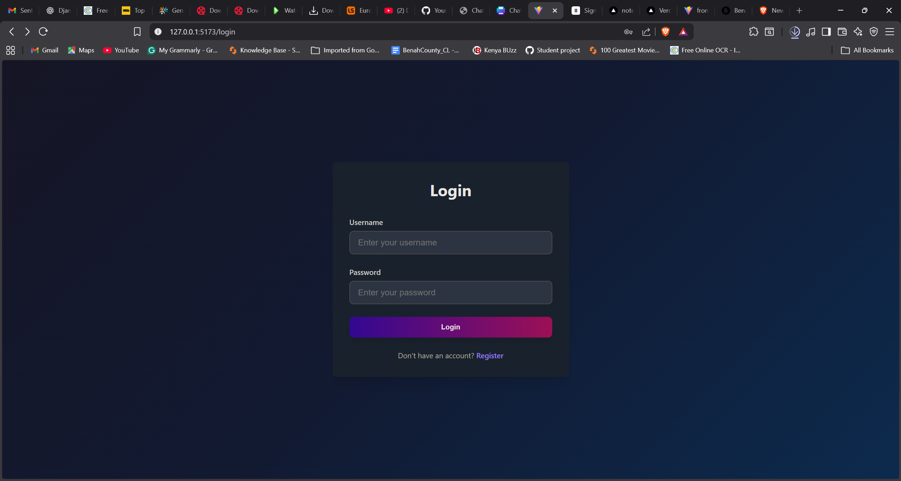
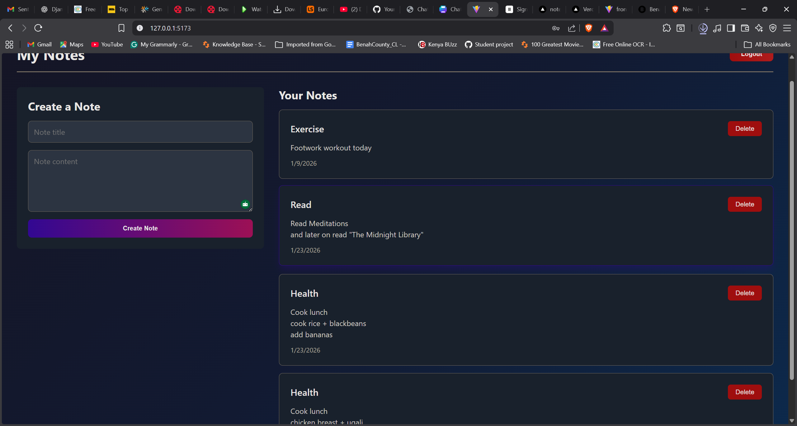

# 📝 Note-App

> A full-stack notes application built with **Django REST Framework** (backend) and **React** (frontend).  
> Users can register, log in, and manage their personal notes.

---

## 🚀 Features

- **User Registration & Login** with JWT authentication
- **Notes Management**:
  - List your notes
  - Create new notes
  - Delete your own notes
- **Permissions**:
  - Registration is public
  - Notes endpoints require authentication

---

## 📁 Project Structure

Note-App/
├── backend/ # Django REST Framework API
├── frontend/ # React frontend
├── assets/ # Images used in README
│ ├── login.png
│ └── home.png
├── README.md
├── .gitignore
└── requirements.txt


---

## 🖥 Frontend Preview

### Login Page


### Home Page / Notes List


> Add more screenshots to this folder (`assets/`) as needed.

---

## ⚡ Backend Setup (Django)

1. Go to the backend folder:

```bash
cd backend
Create and activate a Python virtual environment:

python -m venv venv
# macOS / Linux
source venv/bin/activate
# Windows (PowerShell)
venv\Scripts\Activate.ps1
Install dependencies:

pip install -r requirements.txt
Apply migrations:

python manage.py migrate
Run the development server:

python manage.py runserver
API available at: http://localhost:8000

⚡ Frontend Setup (React)
Go to the frontend folder:

cd frontend
Install dependencies:

npm install
# or
yarn
Start the React development server:

npm start
# or
yarn start
React app opens at: http://localhost:3000

Make sure backend is running so the frontend can fetch data.

🧪 API Endpoints
User Registration
POST /api/user/register/
Request body:

{
  "username": "yourusername",
  "email": "youremail@example.com",
  "password": "yourpassword"
}
JWT Authentication
Obtain token:

POST /api/token/
{
  "username": "yourusername",
  "password": "yourpassword"
}
Refresh token:

POST /api/token/refresh/
{
  "refresh": "<your-refresh-token>"
}
Notes (Authentication Required)
Method	Endpoint	Description
GET	/api/notes/	List all your notes
POST	/api/notes/	Create a new note
DELETE	/api/notes/<id>/	Delete a specific note
Header example:

Authorization: Bearer <your_access_token>
🛠 VSCode Setup Tips
Add .vscode/settings.json:

{
  "python.pythonPath": "backend/venv/bin/python",
  "editor.formatOnSave": true,
  "eslint.validate": ["javascript", "javascriptreact"],
  "files.exclude": {
    "venv/": true
  }
}
🎨 License
MIT License – see the LICENSE file for details.